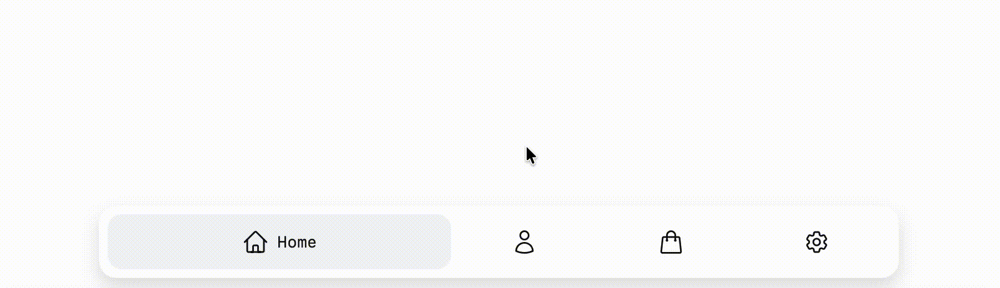

# NavFlex (Minimal Pure CSS Bottom Navbar)

A responsive, accessible bottom navigation bar built with **pure HTML and CSS**.  
Features:

- Expands selected item (flex-grow)
- Dark mode ready (`prefers-color-scheme`)
- No JavaScript, only HTML + CSS

## Demo

---

## 🚀 Getting Started

Clone the repository:

`git clone https://github.com/byteEntropy/RadialMenu.git`

## License

MIT
